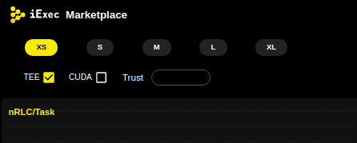

=====================================
TEE End-to-end encryption (Intel SGX)
=====================================

This tutorial describes how to realize a fully secured computation with end-to-end data encryption using the iExec stack.

This additional feature needs extra step, all embedded in the SDK, to prepare the application, dataset and the computation request.

The TEE computation must run on a TEE compatible worker, the requester needs to select a compatible SGX workerpool.

You can find on the marketplace all the available TEE computing resources using the checkbox.

Encrypt and register the dataset
--------------------------------

If you want to protect your dataset you need to encrypt it before making it available on the iExec platform.
this can be easily done with the iExec SDK:
see the `SDK tutorial <https://github.com/iExecBlockchainComputing/iexec-sdk/>`_ for more info.

First, initialize the folder structure

.. code-block:: bash

        iexec dataset init --encrypted

        ℹ Created dataset folder tree for encryption
        ✔ Saved default dataset in "iexec.json", you can edit it:
        owner:     0x62F2a967EaF91976763B96E515E4014a5526b6D3
        name:      my-dataset
        multiaddr: /ipfs/QmW2WQi7j6c7UgJTarActp7tDNikE4B2qXtFCfLPdsgaTQ
        checksum:  0x0000000000000000000000000000000000000000000000000000000000000000

This will create the template for the dataset info in the *iexec.json* and the following folders:

.. code-block:: bash

        ├── datasets
        │   ├── encrypted
        │   └── original
        └── .secrets
            └── datasets

Copy your dataset in the *datasets/original/*  folder, then encrypt it with the SDK:

.. code-block:: bash

        cp /path/to/your/dataset datasets/original/dataset-name
        iexec dataset encrypt --algorithm scone

This command will encrypt your dataset to enable its use in a scone runtime execution.

It will also write the corresponding key and tag in a :code:`.secrets/datasets/<dataset-name>.scone.secret` file.

**You need to upload the encrypted dataset to a public server (for example a Github repository or on IPFS).**

Check with wget command or your web browser to check the encrypted dataset has a public access.

Now, you can deploy the dataset on the marketplace

Then edit the iexec.json to describe your application.

**Don't forget to add the multiaddress of your dataset (where the dataset will be available to download)**.

The checksum field is not used currently, and can be left blank.

.. code-block:: bash

        "dataset": {
          "owner": "0x9A07Ea49a32C1E69eD7B6dFe1aa1C19181465C52",
          "name": "test_sgx",
          "multiaddr": "https://raw.githubusercontent.com/iExecBlockchainComputing/test_sgx/master/sgx_data.zip",
          "checksum": "0x0000000000000000000000000000000000000000000000000000000000000000"
        }

Then deploy your dataset.

.. code-block:: bash

        iexec dataset deploy

        ℹ using chain [kovan]
        ? Using wallet UTC--2019-05-28T16-00-29.164000000Z--9A07Ea49a32C1E69eD7B6dFe1aa1
        C19181465C52
        Please enter your password to unlock your wallet [hidden]
        ✔ Deployed new dataset at address 0x0bF2AEb5e7FCE90DCb39FEEaC49Ce44893CAd31d

Once you dataset is deployed you can push its secret (encryption key and hash of the data) to the SMS.
This is done simply with the SDK:

.. code-block:: bash

       iexec dataset push-secret --secret-path <$PWD/.secrets/datasets/<dataset-name>.scone.secret>

Publish the dataset order

Create an order template

.. code-block:: bash

	iexec order init --dataset

...and edit your dataset order in the *order.json* file,

Edit the order part in iexec.json to describe the dataset.

===================== ==========================================================
Parameter               Meaning
===================== ==========================================================
 dataset                dataset address
 datasetprice           dataset price
 volume                 number of order created
 tag                    tag for extra computational requirement (*)
 datasetrestrict:       restricted to dataset (*)
 workerpoolrestrict     restricted to workerpool (*)
 requesterrestrict:     restricted to requester (*)
===================== ==========================================================

**The dataset has to be enabled with the corresponding tag 0x0000000000000000000000000000000000000001**

.. code-block:: bash

        "datasetorder": {
          "dataset": "0x0bF2AEb5e7FCE90DCb39FEEaC49Ce44893CAd31d",
          "datasetprice": 1000,
          "volume": 1000000,
          "tag": "0x0000000000000000000000000000000000000000000000000000000000000001",
          "apprestrict": "0x0000000000000000000000000000000000000000",
          "workerpoolrestrict": "0x0000000000000000000000000000000000000000",
          "requesterrestrict": "0x0000000000000000000000000000000000000000"
        }

Once your order is ready you can sign it, and send it to the potential user of your dataset. You can also publish it on the iExec marketplace with the SDK:

.. code-block:: bash

        $ iexec order sign --dataset
	$ iexec order publish --dataset

Go to the `Build an SGX-enabled application`_ section to learn how to build the app running on TEE and process securely the dataset.

.. _Build an SGX-enabled application: /buildsgxapp.html

