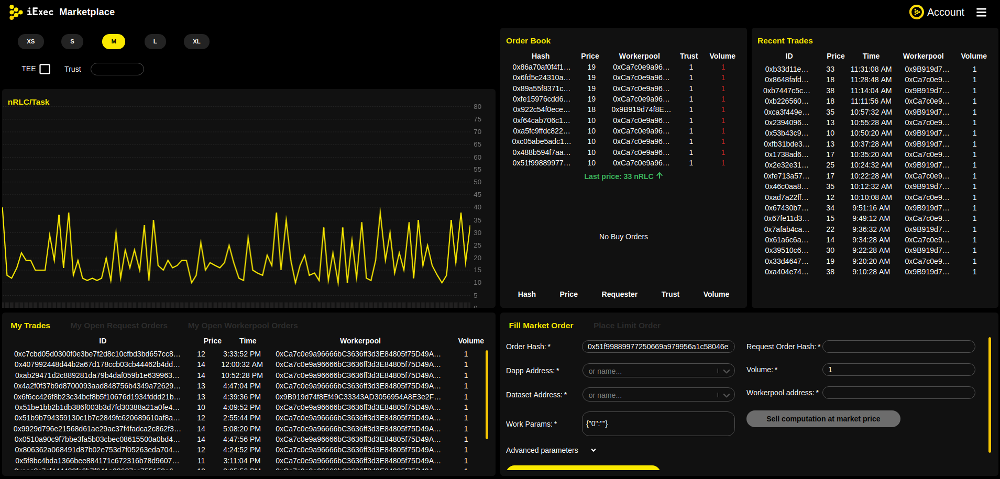
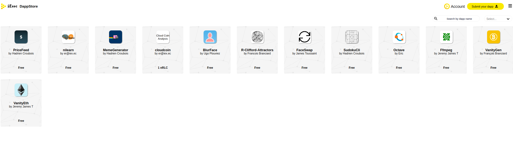
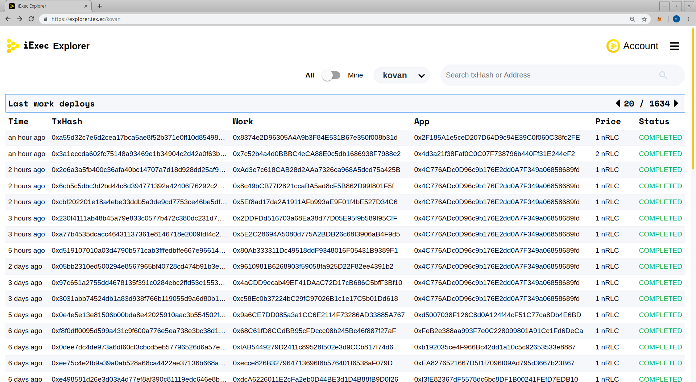
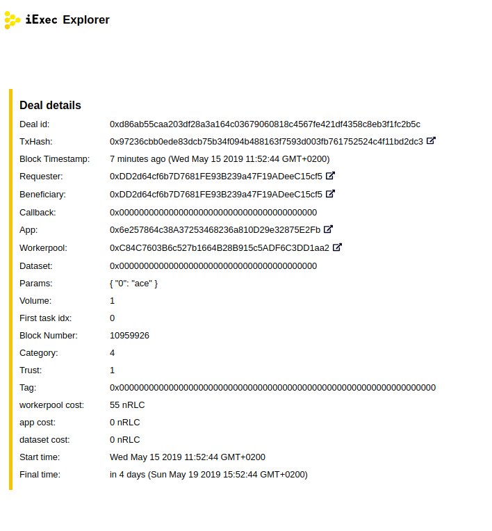
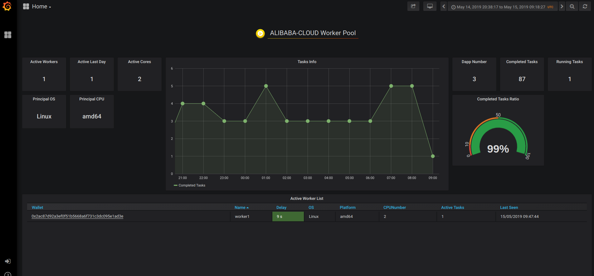

The iExec Solution Stack
========================

The Marketplace
---------------

| The iExec marketplace is where offer meets demand for computing power.
| The marketplace allows application developers and enterprises to access affordable, secure and scalable computing power on-demand.

| Each transaction between buyers and sellers is securely audited and certified by iExec's Proof-of-Contribution algorithm (PoCo).
| At any given moment, the market is able to give customers access to a large capacity of computing power at the best rate.
| Worker pools place **workerpoolorders** defining the price at which they are willing to execute tasks.
| On this marketplace, applications and users buy **workerpoolorders** for their computations to be executed based on pre-selected criteria
| As a multi-sided market, applications and users will publish **requestorder**, that workerpool will accept and compute, this feature will come in V3.

| iExec therefore creates a new paradigm for cloud computing: a global and open market where computing power is traded like a commodity.
| Comparably to the oil market, the iExec marketplace offers a uniform and standardized access to computing resources, regardless of their provider.

Visit the iExec Marketplace (https://market.iex.ec)

Dapp store
----------

The dapp store is a catalog of ready to use applications and tools.

| The DApp Store can be seen as a collection of decentralized applications running on top of iExec.
| Users are able to browse through the listed dapps and use their favorites.
| These dapps are curated and represent the wide span of industries iExec can support: artificial intelligence, 3D rendering, fintech, cryptography, scientific research or IoT.

| Anyone can launch its own Dapp Store and curate applications the way they see fit.

Visit the Dapp store (https://dapps.iex.ec)

Task Explorer
-------------

The iExec Explorer is a user-friendly web application that can explore all relevant information about transactions, applications deployed and worker pools deployed.

For each transaction, the tool provides details on its time of execution, its hash, the user's public address, the dapp's public address, the worker's public address, the price of the deal and the status of the transaction.

Visit the iExex Explorer https://explorer.iex.ec/

Workerpools
-----------

| Workers are organized in worker pools.
| For each one of these, a scheduler manages the work distribution. There are two types of worker pools:
|  - Public worker pools
|  - Private worker pools

| Public worker pools are open for anyone to join. Anyone can also deploy a worker pool for others to join.
| As a worker, if you switch to a different worker pool, you will still be able to maintain your reputation score,
 bringing it “with you” to your new pool, as this is all recorded on the blockchain.

Browse the available Worker Pools: https://pools.iex.ec/

| More information and statistics on the worker pool dashboard.
| https://stimergy-pool.iex.ec/

SDK and API
---------------

| The iExec SDK and API provide a set of tools that allows all users to interact with iExec decentralized marketplace.

| CLI and JS library allowing developers to easily interact with the iExec stack
| Check `iExec SDK documentation <https://github.com/iExecBlockchainComputing/iexec-sdk/>`_ for more details

