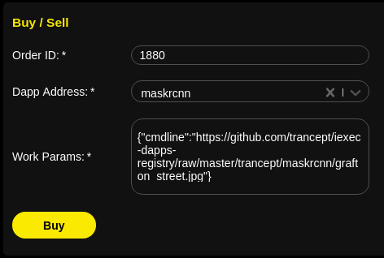

How to execute a task
=====================

The iExec stack provides adapted tools to manage task execution.

Using the iExec SDK
-------------------

| The `iExec SDK <https://github.com/iExecBlockchainComputing/iexec-sdk/>`_ is a CLI (Command Line Interface) tool providing all the commands to interact with the iExec network.
| As an introduction, go to the `Getting Started`_ section to learn how to manage a task execution. For more details, go to `iExec SDK github page <https://github.com/iExecBlockchainComputing/iexec-sdk/>`_ to read its full documentation.

.. _Getting Started: /sdk.html

Using the Marketplace and the Dapp Store
----------------------------------------

Installation of your metamask wallet in your web browser is required.

The marketplace and the Dapp Store allow to buy **workerpoolorders** and submit computing task in a very simple way.

| From the Dapp store, you can select your dapp and will be redirected to the marketplace with the dapp address and default work parameters filled.
 The marketplace selects also the cheapest workerpoolorder available.

| From the marketplace, all existing dapps, published in the Dapp Store, are available in the select menu. It is also possible to fill in any existing dapp address and your custom arguments in the dedicated textboxes.

| Visit the iExec Marketplace (https://market.iex.ec)
| Visit the Dapp store (https://dapps.iex.ec)

For input data, you can use the dirinuri variable to select the data that will be download during the initialization of the task on the worker.
The data must be available online and from a direct link, redirection are not allowed.

.. code-block:: bash

    {
      "order": {
        "buy": {
          "app": "0x2f185a1e5cedf07d64d9c94e39c0f060c38fc2fe",
          "dataset": "0x0000000000000000000000000000000000000000",
          "params": {
            "cmdline": "your_command_line",
            "dirinuri" : "https://github.com/iExecBlockchainComputing/iexec-dapp-samples/raw/blender/apps/iexec-rlc.blend"
          }
        }
      }
    }

Using a custom smart contract ( + Callback )
--------------------------------------------

An exemple on Kovan with factorial dapp.

Minimal installation requirement for the SDK

.. code-block:: bash

    iexec --version
    2.2.39

check you have enough ETH and RLC on Kovan to buy the workorder + dapp Price

.. code-block:: bash

    iexec wallet show

The app factorial on Kovan is reachable from the following address

.. code-block:: bash

    iexec app show 0x2f185a1e5ced207d64d9c94e39c0f060c38fc2fe

Clone callback-kovan branch of Poco repo

.. code-block:: bash

  git clone -b callback-kovan https://github.com/iExecBlockchainComputing/PoCo.git
  cd PoCo
  npm i

| Edit 'mnemonic = "12 words";' in truffle.js and paste your mnemonic admin wallet.
| It will deploy the example contract `IexecAPI <https://github.com/iExecBlockchainComputing/PoCo/blob/callback/contracts/IexecAPI.sol/>`_
| You can customize this contract to your needs (access control, store RLC on it by user, etc ...).
| Then deploy it with:

.. code-block:: bash

    ./node_modules/.bin/truffle migrate --network kovan

Note IexecAPI address:   $IexecAPI_Adresss

1. You must sent some RLC to the IexecAPI contract

.. code-block:: bash

    iexec wallet sendRLC 2000 --to $IexecAPI_Adresss

2. You must approve the IexecAPI to send RLC to the IexecHub:

    - Go to https://www.myetherwallet.com/#contracts and select Network KOVAN

    - add the $IexecAPI_Adresss  in "Contract Address" field.

    - fill '''ABI / JSON Interface''' field with contract ABI found here https://github.com/iExecBlockchainComputing/PoCo/blob/callback-kovan/contracts/IexecAPI.abi

    - click Access and select function approveIexecHub.

    - set amount 2000  (need to cover dappPrice + Market workerpoolorder price)

    - unlock your admin wallet and send transaction.

Check in etherscan transaction is OK and you see approve event.

Click here to see `Transaction example 1 <https://kovan.etherscan.io/tx/0x8083bb585e1414c2833d16637c96deadb0e01ec87891b69fecc8e16b26bdbf21/>`_

3. You must deposit RLC to the IexecHub through IexecAPI to be able to buy workerpoolorder (requester will be the IexecAPI contract and pay the execution):

   - Go to https://www.myetherwallet.com/#contracts and select Network KOVAN

   - add the $IexecAPI_Adresss  in "Contract Address" field.

   - fill "ABI / JSON Interface" fieldwith contract ABI found here :https://github.com/iExecBlockchainComputing/PoCo/blob/callback-kovan/contracts/IexecAPI.abi

   - Click Access and select function depositRLCOnIexecHub.

   - set amount 2000

   -  unlock your admin wallet and send transaction.

check in etherscan transaction is OK and you see Deposit event.

Click here to see `Transaction example 2 <https://kovan.etherscan.io/tx/0x378ad8c8da3c4463ad9decca4a4974dd6eeba53cea444a155db2d0578bdfeb91/>`_

4. You can now buyForWorkOrder on the IexecAPI contract :

   - Go to https://www.myetherwallet.com/#contracts and select Network KOVAN

   - add the $IexecAPI_Adresss  in "Contract Address" field.

   - fill "ABI / JSON Interface" fieldwith contract ABI found here :https://github.com/iExecBlockchainComputing/PoCo/blob/callback-kovan/contracts/IexecAPI.abi

   - Click Access and select function buyForWorkOrder.

   - set params as follow :

================  ==========================================================================================
Parameter         Meaning
================  ==========================================================================================
_marketorderIdx   set one found in the marketplace
_workerpool       set the worker pool address of the _marketorderIdx selected
_app              0x2f185a1e5ced207d64d9c94e39c0f060c38fc2fe
_dataset          0x0000000000000000000000000000000000000000
_params           {"cmdline": "10"}
_callback         the $IexecAPI_Adresss
_beneficiary      your wallet or the wallet that is allowed to download the result.
================  ==========================================================================================

   - set gas estimate to 972397

   - unlock your admin wallet and send transaction.

A buyForWorkOrder transaction successful example :

`Transaction example 3 <https://kovan.etherscan.io/tx/0xb465f9980848f030526035812181263f332fdefe9577aa3e1a7fdda08c2330f9/>`_

Watch the workorder (found woid in the transaction previous Log) :

change 0xe16ada2d83021632cd78a2fbf7620ce485064365 with your woid found.

.. code-block:: bash

    iexec work show 0xe16ada2d83021632cd78a2fbf7620ce485064365 --watch

note : You must see :

 * m_requester  : is your smart contract IexecAPI address. it has pay the execution.
 * m_callback   : is your smart contract IexecAPI address. it will receive the callback.
 * m_beneficiary : is your or the wallet that will be able to download the result.

Then, wait for workerpoolorder m_statusName is COMPLETED.
Check that the callback has been done on your contract.
Successful workOrderCallback tx factorial 10 example :

`Transaction example <https://kovan.etherscan.io/tx/0x562094cf17e83d4c8e8f6d0a05e8a742f88270d37c77e977e6d75160deb6c72c#eventlog/>`_

And Beneficiary can also download the result too :

.. code-block:: bash

    MBPdefrancois2:call fbranci$ iexec work show   0xe16ada2d83021632cd78a2fbf7620ce485064365 --download
    ℹ using chain [kovan]
    ✔ work 0xe16ada2d83021632cd78a2fbf7620ce485064365 status is COMPLETED, details:
    m_workerpool:          0x82190e18f7ce7cb9d39128707f58d19c649cf9c2
    m_params:              {"cmdline": "10"}
    m_requester:           0xf1b2550e4ea1c4ffae1dfb790948c895614e4457
    m_app:                 0x2f185a1e5ced207d64d9c94e39c0f060c38fc2fe
    m_dataset:             0x0000000000000000000000000000000000000000
    m_emitcost:            1
    m_uri:                 xw://api-bench-pool.iex.ec/d17d7bc7-ce85-4cfd-aeea-40ace83e9f89
    m_stdout:
      """
        3628800

      """
    m_resultCallbackProof: 0xe5cb7d00b38206b597110444d4da0600448c754511a43c341a92dab2a99cc061
    m_iexecHubAddress:     0x12b92a17b1ca4bb10b861386446b8b2716e58c9b
    m_callback:            0xf1b2550e4ea1c4ffae1dfb790948c895614e4457
    m_status:              4
    m_marketorderIdx:      1437
    m_stderr:
    m_beneficiary:         0x486a5986f795d323555c0321d655f1eb78d68381
    m_statusName:          COMPLETED

    ✔ downloaded work result to file /Users/fbranci/iexecdev/call/0xe16ada2d83021632cd78a2fbf7620ce485064365.text
    MBPdefrancois2:call fbranci$ cat 0xe16ada2d83021632cd78a2fbf7620ce485064365.text
    3628800

.. include:: contactus.rst
