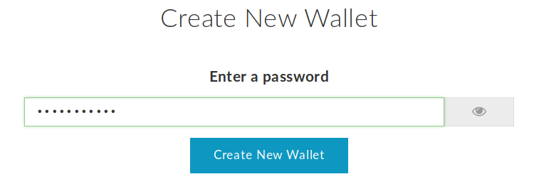
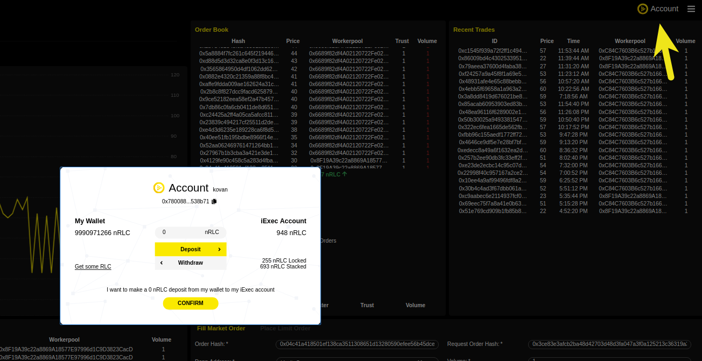

Wallet Management
=================

| The cryptocurrency wallet is a secure software program to interact with blockchains.
| The wallet enables user to send and receive digital currency and monitor their balance and conduct other operations as smart contract.

| iExec service runs on ethereum blockchain, the deal between agents (data owner, resources provider, requestor, developer) are made using RLC token.

| This transaction execution (smart contract) takes some amount of gas in ETH,
 this gas is used to calculate the amount of fees that need to be paid to the network in order to execute an operation.

Create your Wallet
------------------

If you haven’t already, you will need to create an Ethereum wallet:

* Go to MyEtherWallet https://myetherwallet.com
* Create a wallet following MEW’s instructions

.. WARNING::
    Remember your password. You will need it later.
    Back up your wallet properly.

* Download your Keystore file, **keep it safe and secret**.

* To Import the wallet using the Keystore file, you will need to open the downloaded wallet file with any text editor and copy its content.

Useful link:
 - How to get an Ethereum wallet ? https://www.myetherwallet.com/

Credit your wallet with ETH and RLC
-----------------------------------

| Your wallet must be credited with both ether (ETH) and RLC.
| Ether is used to process the smart contracts.

Useful links:
 - How to get some test ETH (Kovan) on your Ethereum wallet ? https://gitter.im/kovan-testnet/faucet
 - How to get some test RLC (Kovan) on your Ethereum wallet ? https://faucet.iex.ec/kovan

Login with Metamask
-------------------

Deposit and withdraw
~~~~~~~~~~~~~~~~~~~~

| Once you’ve unlocked your Metamask, you can login on the iExec marketplace https://market.iex.ec with embedded wallet management.
| In the **Account**, both Balance and Allowance are displayed, and values are expressed in nRLC (nano RLC).
| When a computing deal is closed, a dedicated smart contract is created,
 an allowance step is mandatory to give authority to this new smart contract to proceed to the payment when the computing task is successfully ended.

Wallet management with the SDK
-------------------------------

The iExec SDK provides all features needed to manage one or multiple wallets.

    - **Wallet creation** : you can directly create a new wallet.

    - **Keystore directory** : all the wallets you should manage are now stored in a specified location.

    - **Encrypted wallet** : By default, all the wallet are encrypted in the keystore and protected by a user password.

    - **Import wallet** : You can import (recreate a local wallet file) from a private key.

    - **Using aliases** :     the option --wallet-file allows to use custom filename for your wallet, to ease the management of multiple wallets.

    .. code-block:: bash

        cp ~/.ethereum/keystore/UTC--2019-04-23T08-34-59.991000000Z--7E82621Ea3B9BB78d62e32E88cf97f4B855C36D4 my_custom_wallet_filename
        iexec wallet show --wallet-file my_custom_wallet_filename

    - **Account management** : you can send ETH and RLC to another address. You can deposit and withdraw RLC to your account.

Go checkout the `iExec SDK <https://github.com/iExecBlockchainComputing/iexec-sdk/>`_ page to get wallet management option.

Account and wallet
------------------

iExec is a decentralized exchange and therefore, it uses smart contracts to execute your trades.

iExec does not directly interact nor tap into a user’s wallet. An Ethereum wallet owner remains the sole proprietor of his assets, and needs to deposit RLC from his Ethereum Wallet to his iExec Account for them to be used.

For example, workers must deposit a certain amount of RLC from their Ethereum Wallet to their iExec Account in order to be able to stake and participate as network computers.

Similarly, requesters must have an account topped up with RLC in order to trigger the execution of an application. The amount of RLC engaged in the deal will be locked throughout the execution, and transferred to the cloud resource providers at completion.

For these cloud resource providers (application, compute and dataset providers), the reward from a successfully completed task is deposited in their iExec Account. Providers can then decide to withdraw some or all of their balance from their iExec Account to their Ethereum Wallet at any given time.

The iExecClerk smart contract service is the piece of software that manages under your authority all of your token interactions, with a high degree of security.

Staking and incentives
----------------------

| Staking is a important part of the consensus protocol, to prevent attacks and maintain a high level of trust between participants.
| Workers and schedulers have to commit a security deposit, who computed an erroneous result will lose their stake.
| The movements of RLC is presented below.

+---------------------+----------------+-----------------------+-----------------------------------------------------+
|    **Role**         | **RLC needed** | **ETH needed**        |    **Staking and incentives**                       |
+---------------------+----------------+-----------------------+-----------------------------------------------------+
| Requester           |   yes          |    no                 |    payment, token locked during execution           |
+---------------------+----------------+-----------------------+-----------------------------------------------------+
| App provider        |   no           |    yes for deployment |    reward                                           |
+---------------------+----------------+-----------------------+-----------------------------------------------------+
| Dataset provider    |   no           |    yes for deployment |    reward                                           |
+---------------------+----------------+-----------------------+-----------------------------------------------------+
| Worker              |   yes          |    yes                |    stacking for security deposit, reward            |
+---------------------+----------------+-----------------------+-----------------------------------------------------+
| Scheduler           |   yes          |    yes                |    stacking for security deposit, reward            |
+---------------------+----------------+-----------------------+-----------------------------------------------------+

