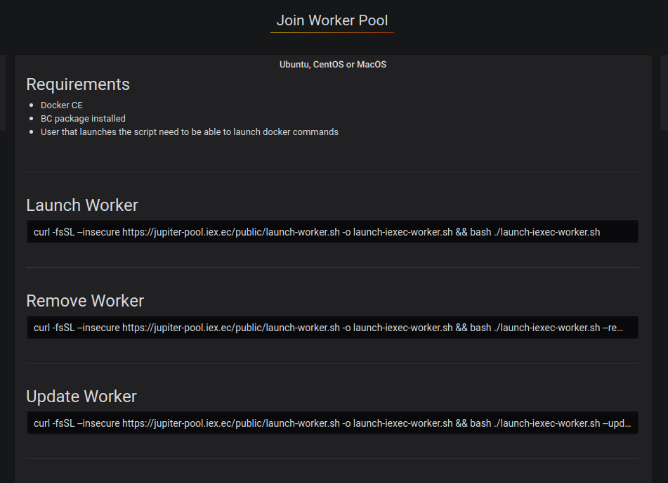

Worker
======

A worker is an essential actor of the iExec Network. It will be in charge of computing tasks sent by requesters on the iExec Marketplace. A worker will be rewarded with RLCs for every properly computed tasks.

Please remember your wallet must be loaded with ETH and RLC must be deposited to your iExec account in order to stake for incoming tasks.

Start a worker
--------------------------
=======

You will find a list of workerpools at https://pools.iex.ec/

After having loaded some ETH and deposited some RLC to your iExec account, you can start your worker.

You have different ways to join a workerpool:

* with Docker
* with Join-Workerpool scripts
* with a Virtual Machine

Docker
----------------------------

In a terminal, run:

.. code:: bash
		
	docker run -d --name "my-iexec-worker" \
           --hostname "my-iexec-worker" \
           --env "IEXEC_WORKER_NAME=my-iexec-worker" \
           --env "IEXEC_CORE_HOST=main-pool.iex.ec" \
           --env "IEXEC_CORE_PORT=18090" \
           --env "IEXEC_WORKER_WALLET_PATH=/iexec-wallet/wallet.json" \
           --env "IEXEC_WORKER_WALLET_PASSWORD=mypassw00rd" \
           -v /home/ubuntu/wallet.json:/iexec-wallet/wallet.json \
           -v /tmp/iexec-worker:/tmp/iexec-worker\
           -v /var/run/docker.sock:/var/run/docker.sock \
           iexechub/iexec-worker:3.X.X

Please get the lastest version available (3.X.X) `here <https://hub.docker.com/r/iexechub/iexec-core/tags>`_. Note that it must match the version of the scheduler.

Please note that all the values shown here are just given as an example, it should be adapted to the worker workerpool you are trying to join and to the machine on which the worker will run.

Here is the details for the different parameters used in the command:

=============================================  ==========================================================================================
Parameter                                       Meaning
=============================================  ==========================================================================================
IEXEC_WORKER_NAME                              Name of your worker on the workerpool dashboard
EXEC_CORE_HOST                                 Domain of the scheduler
IEXEC_CORE_PORT                                Port of the scheduler
IEXEC_WORKER_BASE_DIR                          | Should match the tmp folder your mounting (-v /tmp/iexec-worker).
                                               | Results of tasks will be stored in /tmp/iexec-worker/my-iexec-worker)
IEXEC_GAS_PRICE_MULTIPLIER:                    Increase it will speed up transactions (default: 1.3)
IEXEC_WORKER_OVERRIDE_BLOCKCHAIN_NODE_ADDRESS  Use a custom ethereum node here, otherwise the one given by the core will be used
=============================================  ==========================================================================================

Regarding the volumes mounted with the -v option in the docker run command, they are mandatory, **if not defined the worker may not behave as expected**:

1. The option *-v /home/ubuntu/wallet.json:/iexec-wallet/wallet.json* is used for the worker to know which wallet to use.
2. The option *-v /tmp/iexec-worker:/tmp/iexec-worker* will be used to store all the results from the worker.
3. The option *-v /var/run/docker.sock:/var/run/docker.sock* is to allow the worker to start new docker containers when performing tasks. 

**Supported CPU**

* x86
* x86_64

**Supported OS**

* Linux
* MacOS
* Windows

Join-Workerpool script
-----------------------------------

When available, click on the "Join Worker Pool" button on the top left of the dashboard page and follow instructions.

**Supported OS**

* Linux

Virtual Machine (VM)
----------------------------

A VM is ready to make you join the public workerpool.

1. Download the VM 

https://download.iex.ec/iExec-Public-Worker.ova
(mirror: https://drive.google.com/file/d/1Q655sygSbqCffmwi8G12leMzbRQLOI9x/)

2. Install Virtual Box

https://www.virtualbox.org/wiki/Downloads

3. Get or create a wallet

Keep your wallet in a safe place, you will need it later.
Same advice for your wallet password, you will need it later.
Go to the 'Wallet Managment' section for more information

4. Top up some ETH & RLC and make a RLC deposit to your iExec account

Go to the 'Wallet Managment' section for more information

5. Launch the VM

To import the VM, just click on iexec-worker.ova file. You will see the “Import Virtual Appliance” window. If you only have 4GB of RAM, please change the RAM to 2,048MB in this window.
Delete the previous version if you had installed any in the past. 
Click on the ‘Import’ button.
Double click on ‘iExec-Worker’ (or click on ‘start’).

6. Copy your wallet from your host computer to the VM

Open the ‘keystore’ folder, then copy/paste the content of your wallet file from your host computer into the ‘wallet.json’ file of the VM.

7. Start your worker

Click on “Launch Worker” on the VM desktop.
Enter the worker name and the wallet password
When the worker initialization process is complete, the worker will be started and you will get something like:
**You worker is all set**.
Your worker will now be able to compute some tasks comming from the iExec network to earn some RLCs.

Note: If you want to properly shutdown your worker, you can click on the “Stop Worker” icon placed in the desktop of the VM

**Supported OS**

* Linux
* MacOS
* Windows

Wallet restriction
------------------

An exclusive wallet must be associated to your worker.
You need N wallets if you want N workers. 

